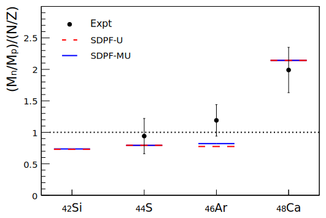
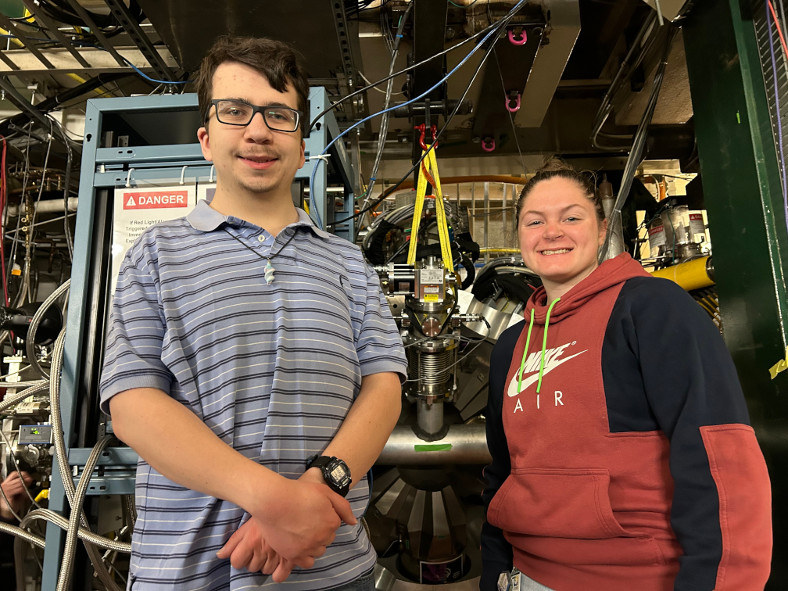
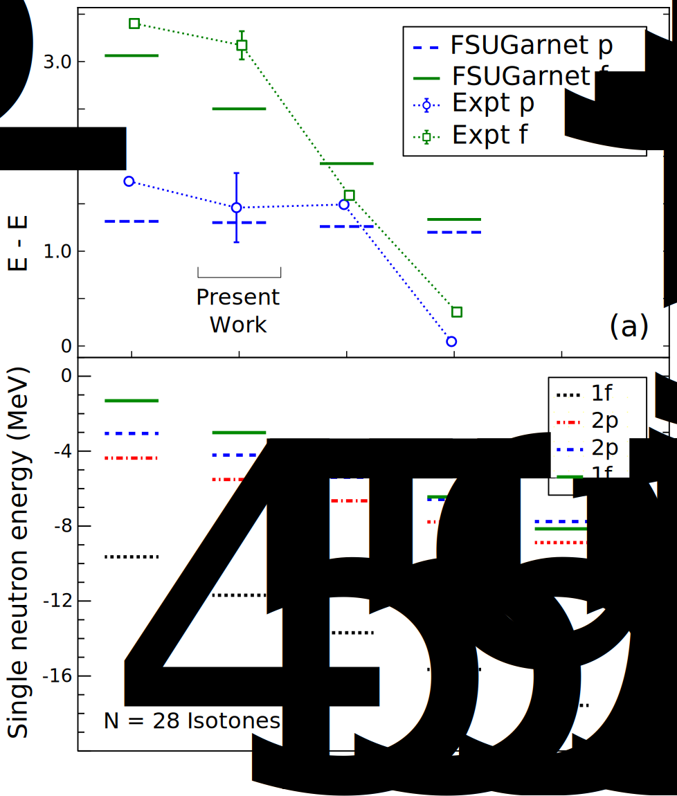
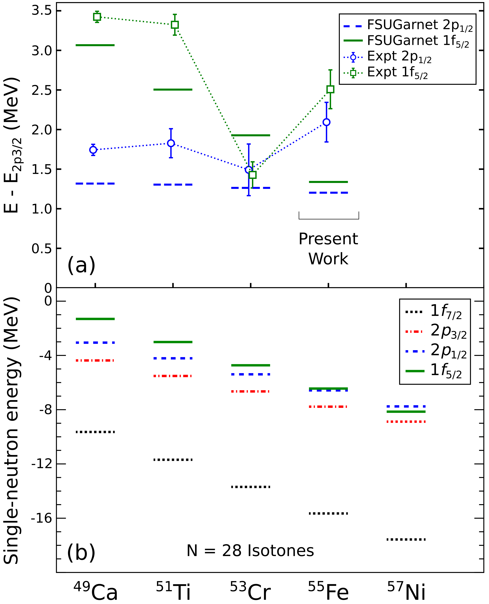
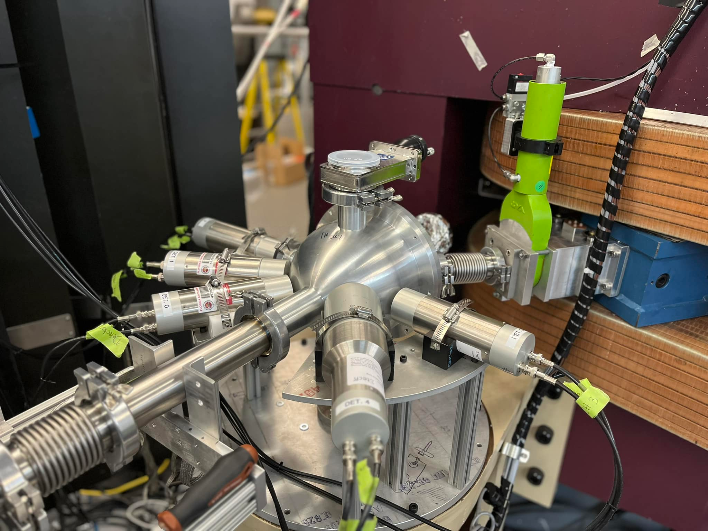

## Experimental Nuclear Structure

The Ursinus College Nuclear Structure Group collaborates with nuclear scientists on experiments at accelerator laboratories like the [John D. Fox Laboratory at Florida State University (FSU)](https://fsunuc.physics.fsu.edu/research/fox_lab) and the [Facility for Rare Isotope Beams at Michigan State University (FRIB)](https://frib.msu.edu). Our experimental work is focused on understanding the interplay between collective nuclear behavior, such as vibrations and rotations of the entire system, and the behavior of the individual protons and neutrons within it. 

Our work is funded by National Science Foundation Grant Nos. [PHY-2208804, “RUI: Shell Structure and Collective Excitations in Exotic Nuclei"](http://www.nsf.gov/awardsearch/showAward?AWD_ID=2208804) and [PHY-2405485, "MRI: A New CeBr3 Gamma-Ray Detection Array (CeBrA) for Particle-Gamma Coincidence Experiments at the FSU Super-Enge Split-Pole Spectrograph,"](https://www.nsf.gov/awardsearch/showAward?AWD_ID=2405485).

### Inverse-Kinematics Proton Scattering and Coulomb Excitation at the NSCL/FRIB

We have been studying the systematic behavior of proton and neutron contributions to collective excitations of N=28 isotones "south" of 48Ca since 2003. Most recently, we have been using the GRETINA gamma-ray tracking array and the NSCL/Ursinus liquid hydrogen target for these studies. There significant experimental evidence for the erosion of the N=28 shell approaching  42Si. 

> 
>
> Ratios of neutron to proton transition matrix elements <I>Mn/Mp</I> expressed relative to <I>N/Z</I> for even-even <I>N = 28</I> isotones compared with shell-model predictions.
>
> <SMALL>Inverse-kinematics proton scattering from 42,44S, 41,43P, and the collapse of the <I>N=28</I> major shell closure, L. A. Riley, D. Bazin, J. Belarge, P. C. Bender, B. A. Brown, P. D. Cottle, B. Elman, A. Gade, <B>S. D. Gregory</B>, <B>E. B. Haldeman</B>, K. W. Kemper, <B>B. R. Klybor</B>, <B>M. A. Liggett</B>, S. Lipschutz, B. Longfellow, E. Lunderberg, T. Mijatovic, J. Pereira, <B>L. M. Skiles</B>, R. Titus, A. Volya, D. Weisshaar, J. C. Zamora, and R. G. T. Zegers, <A HREF="https://doi.org/10.1103/PhysRevC.100.044312">Phys. Rev. C <B>100</B>, 044312 (2019)</A>, [arXiv:1910.07986](https://arxiv.org/abs/1910.07986).</SMALL>

In spring and summer of 2023, we began the process of expanding this experimental picture to 42Si at FRIB with a Coulomb excitation experiment.

> 
>
> Mill Heinze (UC 2024), Jake Kosa (UC 2024), and Alyssa Himmelreich (UC 2026) in the "Data U" where users monitor their data during experiments at FRIB.

>  
> 
> The Gretina gamma-ray tracking array installed at the focus of the S800 magnetic spectrograph at FRIB.

 We returned to FRIB in March 2024 for the complementary proton-scattering measurements of 44S and 42Si.
 
> 
>
> Blake McNulty (UC 2026), Alyssa Himmelreich (UC 2026), and Alyssa Himmelreich (UC 2026) in front of GRETINA and the NSCL/Ursinus liquid hydrogen target at FRIB in March 2024.

### Neutron Transfer at John D. Fox Superconducting Linear Accelerator Laboratory at Florida State University (FSU)

We are using the Super Enge Split-Pole Spectrograph (SPS) at FSU to measure high-resolution proton momentum spectra and proton angular distributions from (d,p) reactions in an effort to investigate the energies of neutron orbitals beyond the N=28 shell and how they vary with proton number. We began with a measurement of 50Ti(d, p)51Ti.

> 
>
> (a) Measured f 5/2 and p 1/2 single neutron energy centroids, relative to the <I>p3/2</I> energy compared with covariant density functional theory. (b) Single neutron binding energies
> calculated using covariant density functional theory.
>
> <SMALL>50Ti(d, p)51Ti: Single-neutron energies in  the N = 29 isotones, and the N = 32 subshell closure,  L. A. Riley, <B>J. M. Nebel-Crosson</B>, K. T. Macon, G. W. McCann,  L. T. Baby, D. Caussyn, P. D. Cottle, J. Esparza, K. Hanselman, K. W. Kemper,  E. Temanson, and I. Wiedenh&#246;ver, <A HREF="https://doi.org/10.1103/PhysRevC.103.064309">Phys. Rev. C <B>103</B>, 064309 (2021)</A>, [arXiv:2106.05781](https://arxiv.org/abs/2106.05781).</SMALL>

In summer of 2021, we made a measurement of 54Fe(d, p)55Fe.

> 
>
> (a) Measured f 5/2 and p 1/2 single neutron energy centroids, relative to the <I>p3/2</I> energy compared with covariant density functional theory. (b) Single neutron binding energies
> calculated using covariant density functional theory.
>
> <SMALL>54Fe(d, p)55Fe and the evolution of single neutron energies in the <I>N=29</I> isotones, L. A. Riley, <B>I. C. S. Hay</B>, L. T. Baby, A. L. Conley, P. D. Cottle, J. Esparza, K. Hanselman, B. Kelly, K. W. Kemper, K. T. Macon, G. W. McCann, <B>M. W. Quirin</B>, R. Renom, <B>R. L. Saunders</B>, M. Spieker, and I. Wiedenh&#246;ver, <A HREF="https://doi.org/10.1103/PhysRevC.106.064308">Phys. Rev. C <B>106</B>, 064308 (2022)</A>, [arXiv.2212.04384](https://arxiv.org/abs/2212.04384).</SMALL>

In summer of 2022 we completed a remeasurement of 52Cr(d,p)53Cr to complete the picture of <I>g9/2 strength in the N = 29 isotones.

> <SMALL> g9/2 neutron strength in the <I>N=29</I> isotones and the 52Cr(d, p)53Cr reaction, L. A. Riley, <B>D. T. Simms</B>, L. T. Baby, A. L. Conley, P. D. Cottle, J. Esparza, K. Hanselman, <B>I. C. S. Hay</B>, <B>M. Heinze</B>, B. Kelly, K. W. Kemper, G. W. McCann, R. Renom, M. Spieker, and I. Wiedenh&#246;ver, <A HREF="https://doi.org/10.1103/PhysRevC.108.044306">Phys. Rev. C <B>108</B>, 044306 (2023)</A>, [arXiv.2310.06722](https://arxiv.org/abs/2310.06722).</SMALL>

In the summers of 2023 and 2024, we used the CeBrA demonstrator array of CeBr gamma-ray detectors to collect proton-gamma-ray coincidence data from neutron transfer to 52Cr (Mill Heinze and Ian Conroy, summer 2023) and 61Ni (Ewan Chattin, summer 2024). Gamma-ray angular distributions can be used to clarify angular momentum and parity assignments to excited states. In late summer 2024, we learned that the National Science Foundation will fund the full CeBrA array via [NSF-MRI grant no. PHY-2405485](https://www.nsf.gov/awardsearch/showAward?AWD_ID=2405485).

> 
>
> The CeBrA demonstrator for particle-gamma coincidence experiments at the FSU Super-Enge Split-Pole Spectrograph, A. L. Conley, B. Kelly, M. Spieker, R. Aggarwal, S. Ajayi, L. T. Baby, S. Baker, C. Benetti, <B>I. Conroy</B>, P. D. Cottle, I. B. D’Amato, P. DeRosa, J. Esparza, S. Genty, K. Hanselman, I. Hay, <B>M. Heinze</B>, D. Houlihan, M. I. Khawaja, P. S. Kielb, A.N. Kuchera, G.W. McCann, A. B. Morelock, E. Lopez-Saavedra, R. Renom, L. A. Riley, G. Ryan, A. Sandrik, V. Sitaraman, E. Temanson, M. Wheeler, C. Wibisono, I. Wiedenh&#246;ver, <A HREF="https://doi.org/10.1016/j.nima.2023.168827">Nucl. Instr. Meth. <B>A1058</B>, 168827 (2023)</A>, [arXiv.2311.00831](https://arxiv.org/abs/2311.00831).

