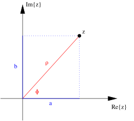
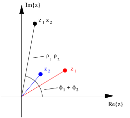
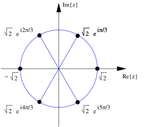

---

title: Uncertainties

layout: single

style: single

---

Review of Complex Numbers
=========================

Cartesian Form and the Complex Plane
------------------------------------

-   Complex numbers and functions contain the number $i = \sqrt{-1}$.

-   Any complex number or function $z$ can be written in **Cartesian
    form**,

    $$\label{eq:z}
        z = a + i b$$

    where $a$ is the **real part** of $z$ and $b$ is the **imaginary
    part** of $z$, often denoted $a = Re\{z\}$ and $b = Im\{z\}$,
    respectively. Note that $a$ and $b$ are both real numbers.

-   The form of Eq. 1 is called Cartesian, because if we think of $z$ as
    a two dimensional vector and $Re\{z\}$ and $Im\{z\}$ as its
    components, we can represent $z$ as a point on the **complex
    plane**.

    

Polar Form
----------

-   As with a two dimensional vector, a complex number can be written in
    a second form, as a magnitude $\rho$ and angle $\phi$,

    $$\rho = \sqrt{a^2 + b^2}$$

    $$\tan \phi = \frac{b}{a} ~~(+ \pi~\mathrm{if}~a<0)$$

    $$a = \rho \cos \phi$$

    $$b = \rho \sin \phi.$$

    where $\phi$ is called the **complex phase** of $z$.

Exponential Form
----------------

-   Euler's formula relates a complex number on the unit circle
    expressed in terms of trigonometric functions to the complex
    exponential function.

    $$\label{eq:Euler}
        e^{\pm i\phi} = \cos \phi \pm i \sin \phi.$$

    This can be shown by comparing the Taylor series expansions of
    $e^{i\phi}$, $\cos \phi$, and $\sin \phi$. It follows that a complex
    number $z$ can be written in a third form,

    $$\label{eq:zExp}
        z = \rho e^{i\phi}.$$

    

-   Eq. 7 provides a useful way of looking at multiplication of complex
    numbers. The product $z_1 z_2$ is obtained by multiplying magnitudes
    and adding complex phases,

    $$z_1 z_2 = \rho_1 \rho_2 e^{i(\phi_1 + \phi_2)}.$$

-   Raising complex numbers to powers is also simplified by Eq. 7

    $$\label{eq:zPow}
        (z)^p = \rho^p e^{i p \phi}.$$

    For example, we can evaluate $(i+1)^4$, noting that

    $$1+i = \sqrt{2} \, e^{i\frac{\pi}{4}}$$

    and using Eq. 9, we find

    $$(1+i)^4 = (\sqrt{2})^4 \, (e^{i\frac{\pi}{4}})^4 
        = 4 \, e^{i\pi} = -4$$

Complex Conjugation and the Complex Square
------------------------------------------

-   The **complex conjugate** of $z = a + ib = \rho e^{i\phi}$ is

    $$z^* = a - ib = \rho e^{-i \phi}.$$

    It is obtained by changing the sign of $i$ wherever it appears in
    $z$.

    -   To calculate the magnitude $\rho$ directly from $z$ written in
        any form, we use the **complex square**,

        $$|z|^2 = z^* z$$

        The complex square in terms of $a$ and $b$ is

        $$|z|^2 = (a + ib)(a - ib) = a^2 + iba - iab - (i^2)b^2 
              = a^2 + b^2 = \rho^2$$

        and in terms of $\rho$ and $\phi$

        $$|z|^2 = \rho e^{-i \phi} \rho e^{i \phi} = \rho^2.$$

        Hence,

        $$\rho = \sqrt{|z|^2}.$$

    -   We can also use complex conjugation to separate the real and
        imaginary parts of $z$.

        $$z + z^* = a + ib + a - ib = 2a$$

        so

        $$\label{eq:Re}
              Re\{z\} = \frac{z + z^*}{2}$$

        similarly

        $$\label{eq:Im}
              Im\{z\} = \frac{z - z^*}{2i}$$

        For example, it follows from Eq.'s 18 and 19 together with Eq. 6
        that

        $$\nonumber
              Re\{e^{i\phi}\} = \cos \phi = \frac{e^{i\phi} + e^{-i\phi}}{2}$$

        $$Im\{e^{i\phi}\} = \sin \phi = \frac{e^{i\phi} - e^{-i\phi}}{2i}$$

Finding Roots
-------------

-   $\sqrt[n]{z}$ has $n$ unique values for integer $n$. For example,
    $\sqrt{4} = +2, -2$. In general, some or all of the $n$ roots are
    complex numbers.

-   The cyclical nature of angles means that

    $$z = \rho e^{i\phi},\,\rho e^{i(\phi + 2\pi)}, \,\rho e^{i(\phi + 4\pi)}, \,\rho e^{i(\phi + 6\pi)}, ...$$

    all represent the same number.

-   However, if we take the nth root of these representations of $z$, we
    find that there are $n$ unique results with complex phase angles
    less than $2 \pi$.

-   **Example**

    -   The first 6 representations of $z=8$ are

        $$8 = 8, \,8e^{i2\pi}, \,8e^{i4\pi}, 
              \,8e^{i6\pi}, \, 8e^{i8\pi}, \,8e^{i10\pi}.$$

        Taking the 6th root, we obtain

        $$\sqrt[6]{8} = \sqrt{2}, \,\sqrt{2} e^{i \pi/3}, 
              \,\sqrt{2}  e^{i 2\pi/3}, 
              \,\sqrt{2}  e^{i \pi}, \,\sqrt{2}  e^{i 4\pi/3}, 
              \,\sqrt{2}  e^{i 5\pi/3}$$

        The rest of the roots have complex phase $\geq 2\pi$ and all of
        them are alternate representations of the six roots above.

    -   Graphically,

        

-   In general, to find the $n$ roots of a number $z = \rho
      e^{i\phi}$, start with $\sqrt[n]{\rho} e^{i\phi/n}$. The remaining
    roots lie, along with the first, on a circle of radius
    $\sqrt[n]{\rho}$ in the complex plane at an equal spacing of
    $2\pi/n$ in phase angle.

This work is licensed under the Creative Commons Attribution-ShareAlike
4.0 International License:
<http://creativecommons.org/licenses/by-sa/4.0/>.\
L.A. Riley (`lriley@ursinus.edu`), updated June 2021
