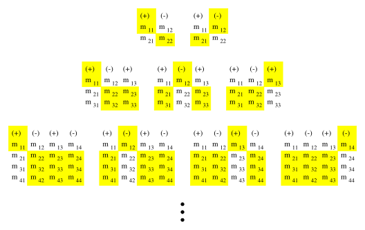

---

title: Calculating Determinants

layout: single

style: single

---

Calculating Determinants
------------------------

-   The determinant of a $2 \times 2$ matrix

    $$M = 
    \left(
    \begin{array}{cccc}
    m_{11}  & m_{12} \\
    m_{21}  & m_{22} 
    \end{array}
    \right)$$

    is given by

    $$|M| = 
    \left|
    \begin{array}{cccc}
    m_{11}  & m_{12} \\
    m_{21}  & m_{22} 
    \end{array}
    \right|
    = m_{11} \, m_{22} - m_{12} \, m_{21}$$

-   The determinant of a $3 \times 3$ matrix

    $$M =
    \left(
    \begin{array}{cccc}
    m_{11}  & m_{12} & m_{13} \\
    m_{21}  & m_{22} & m_{23} \\
    m_{31}  & m_{32} & m_{33} 
    \end{array}
    \right)$$

    can be written in terms of the determinants of $2 \times 2$
    sub-matrices

    $$|M| =
    \left|
    \begin{array}{cccc}
    m_{11}  & m_{12} & m_{13} \\
    m_{21}  & m_{22} & m_{23} \\
    m_{31}  & m_{32} & m_{33} 
    \end{array}
    \right| \\
    = m_{11} 
    \left|
    \begin{array}{cccc}
    m_{22}  & m_{23} \\
    m_{32}  & m_{33} 
    \end{array}
    \right| 
    \,-\, m_{12} 
    \left|
    \begin{array}{cccc}
    m_{21}  & m_{23} \\
    m_{31}  & m_{33} 
    \end{array}
    \right| 
    \,+\, m_{13} 
    \left|
    \begin{array}{cccc}
    m_{21}  & m_{22} \\
    m_{31}  & m_{32} 
    \end{array}
    \right|$$

-   In general, each element of the top row of the matrix is multiplied
    by the determinant of the sub-matrix obtained by removing the row
    and column containing that element. The results are then added
    together with alternating sign, starting with a positive $m_{11}$
    term. Figure 1 shows the top-row elements and the associated
    sub-matrices and signs for the $2 \times 2$, $3 \times 3$, and
    $4 \times 4$ cases.

Figure 1: A visual guide to computing the determinants of $2 \times 2$,
$3 \times 3$, and $4 \times 4$ matrices.

### An $\mathbf{n=2}$ Example

$$M =  
\left(
\begin{array}{cccc}
3  & -1 \\
5  &  7 
\end{array}
\right)$$

$$|M| = 3 \cdot 7 - (-1)\cdot 5 = 21 + 5 = 26$$

### An $\mathbf{n=3}$ Example

$$M =
\left(
\begin{array}{cccc}
 4 &  2 & 5 \\
-1 &  6 & 7 \\
 3 &  1 & 2
\end{array}
\right)$$

$$|M| =
4
\left|
\begin{array}{cccc}
6 & 7 \\
1 & 2
\end{array}
\right| 
\,-\, 2
\left|
\begin{array}{cccc}
-1 & 7 \\
 3 & 2
\end{array}
\right| 
\,+\, 5
\left|
\begin{array}{cccc}
-1 & 6 \\
 3 & 1
\end{array}
\right|$$

$$= 4 \, (6 \cdot 2 - 7 \cdot 1)
  - 2 \, ((-1) \cdot 2 - 7 \cdot 3)
  + 5 \, ((-1) \cdot 1 - 6 \cdot 3)\\
= 20 + 46 - 95 \\
= -29$$

This work is licensed under the Creative Commons Attribution-ShareAlike
4.0 International License:
<http://creativecommons.org/licenses/by-sa/4.0/>.\
L.A. Riley (`lriley@ursinus.edu`), updated June 2021
