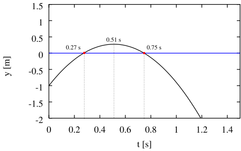

---

title: The Quadratic Formula

layout: single

style: single

---

The Quadratic Formula
---------------------

-   Equations of the form

    $$\label{eq:quadratic}
        ax^2 + bx + c = 0$$

    are called **quadratic equations**. The **quadratic formula**

    $$\label{eq:qFormula}
        x = -\frac{b}{2a} \pm \frac{\sqrt{b^2 - 4ac}}{2a}$$

    gives the solutions.

-   The $\pm$ in Eq. 2 is an important detail. In general, there are two
    solutions to a quadratic equation. The two solutions are also called
    the **roots of the equation**.

-   **Example**

    A ball is tossed directly upward from a height of 2.0 m above the
    ground with an initial velocity of 5.0 m/s. It is subject only to
    the force of gravity while in flight, so it has an acceleration of
    -9.8 m/s$^2$. When does the ball reach a height of 3.0 m? The
    position of the ball as a function of time is given by the equation

    $$y = y_o + v_o t + \frac{1}{2}a t^2.$$

    **Solution**

    The equation with the given information is

    $$3.0~\mathrm{m} = 2.0~\mathrm{m} + (5.0~\mathrm{m/s}) t 
        + (-4.9~\mathrm{m/s}^2) t^2$$

    which in the form of Eq. 1 becomes

    $$\label{eq:example}
        (-4.9~\mathrm{m/s}^2) t^2 + (5.0~\mathrm{m/s}) t + (-1.0~\mathrm{m}) = 0.$$

    We can identify $a =-4.9~\mathrm{m/s}^2$, $b = 5.0~\mathrm{m/s}$,
    and $c = -1.0~\mathrm{m}$ and apply Eq. 2,

    $$t = -\frac{5.0~\mathrm{m/s}}{2(-4.9~\mathrm{m/s}^2)} 
        \pm \frac{\sqrt{(5.0~\mathrm{m/s})^2 - 
            4(-4.9~\mathrm{m/s}^2)(-1.0~\mathrm{m})}}
            {2(-4.9~\mathrm{m/s}^2)}
            = 0.51~s \mp 0.24~s = 0.27~s, 0.75~s.$$

    

    Figure 1: The left side of Eq. 5 plotted vs. $t$.

    -   To understand the two solutions, the graph of the left side of
        Eq. 5 shown in Fig. 1 is helpful. The extreme value of the
        quadratic occurs at $-\frac{b}{2a}$. In the example, the extreme
        value is at 0.51 s.

    -   The roots of the quadratic lie $\frac{\sqrt{b^2 - 4ac}}{2a}$ to
        either side of $-\frac{b}{2a}$. In the example, the two roots of
        the equation lie 0.24 s to either side of 0.51 s.

    -   A graph like this is often helpful in choosing appropriate
        solutions. In the example, both roots of the equation are
        appropriate. The ball reaches a height of 3.0 m twice, once
        going up, and once coming down.

-   **Special Cases**

    -   **Single solution**

        If $4ac = b^2$, then $\sqrt{b^2-4ac} = 0$, and there is only one
        solution, $x=-\frac{b}{2a}$. In the above example, this
        corresponds to 0.51 s, the time at which the ball reaches its
        maximum height.

    -   **Complex solutions**

        If $4ac > b^2$, then $\sqrt{b^2-4ac}$ is imaginary (involves
        $i =
            \sqrt{-1}$). The above example does not have a physically
        reasonable solution corresponding to this situation. (This
        situation corresponds to heights never reached by the ball.)

This work is licensed under the Creative Commons Attribution-ShareAlike
4.0 International License:
<http://creativecommons.org/licenses/by-sa/4.0/>.\
L.A. Riley (`lriley@ursinus.edu`), updated June 2021
