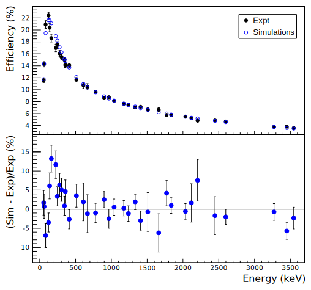
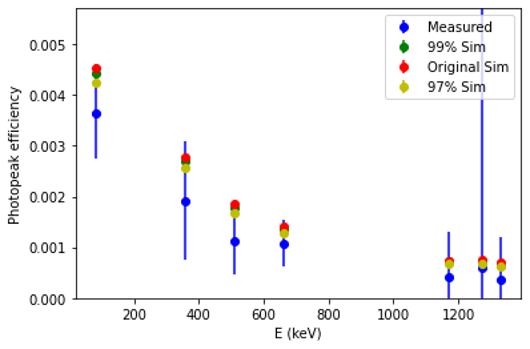

## Detector Simulation Projects

### [UCGretina](https://github.com/rileyle/UCGretina)

... a [Geant4](https://geant4.web.cern.ch) simulation of the Gamma Ray Energy Tracking Array (GRETA) – an array of gamma-ray tracking detectors used in nuclear physics experiments at ANL, the NSCL, and FRIB.

> 
>
> (Top panel) Measured (full circles) and simulated (open circles) photopeak efficiencies of the 12-quad standard NSCL configuration of the GRETINA array. (Bottom panel) Relative discrepancies between simulated and simulated and measured efficiencies.
>
> <SMALL>UCGretina GEANT4 simulation of the GRETINA Gamma-Ray Energy Tracking Array, L. A. Riley, D. Weisshaar, H. L. Crawford, <B>M. L. Agiorgousis</B>, C. M. Campbell, M.Cromaz, P. Fallon, A. Gade, <B>S. D. Gregory</B>, <B>E. B. Haldeman</B>, <B>L. R. Jarvis</B>, <B>E. D. Lawson-John</B>, <B>B. Roberts</B>, <B>B. V. Sadler</B>, <B>C. G. Stine</B>, <A HREF="https://doi.org/10.1016/j.nima.2021.165305"> Nucl. Instr. Meth. <B>A1003</B>, 165305 (2021)</A>, [arXiv:2104.09986](https://arxiv.org/abs/2104.09986).</SMALL>

### [UCNa](https://github.com/rileyle/UCNaI)

... a [Geant4](https://geant4.web.cern.ch) simulation of the Bicron 2M2 sodium iodide (NaI) scintillator detectors we use in our advanced laboratory courses for gamma-ray spectroscopy and cosmic-ray observation.

  > 
  > 
  > Ray Saunders collected source spectra and ran UCNaI simulations in Spring 2021. The simulations systematically over-predict the efficiencies. The green and yellow show simulations with reduced crystal volume. 

Recent publications and work with students are highlighted on my [Ursinus profile](https://www.ursinus.edu/live/profiles/189-lew-riley).

